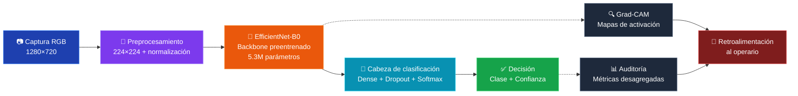
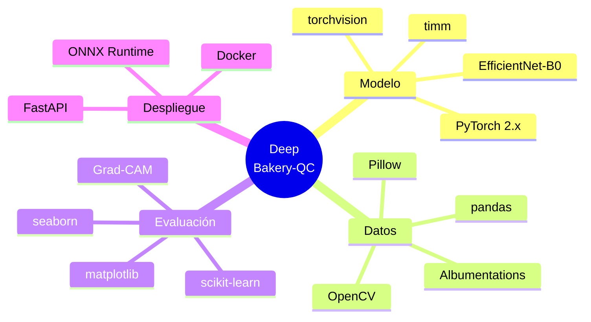

# Deep Bakery-QC

> Diseño de un algoritmo de aprendizaje profundo para detectar defectos en productos de panadería y pastelería artesanal. Un proyecto académico que nace de cuatro años trabajando en panadería en Bucaramanga.

[]()
[]()
[]()
[]()
[]()

---

## Tabla de contenidos

- [Sobre este proyecto](#sobre-este-proyecto)
- [Contexto académico](#contexto-académico)
- [El problema, en una frase](#el-problema-en-una-frase)
- [Arquitectura del sistema](#arquitectura-del-sistema)
- [Stack tecnológico](#stack-tecnológico)
- [Estructura del repositorio](#estructura-del-repositorio)
- [Plan de pruebas](#plan-de-pruebas)
- [Resultados esperados](#resultados-esperados)
- [Consideraciones éticas](#consideraciones-éticas)
- [Cosas que todavía no tengo resueltas](#cosas-que-todavía-no-tengo-resueltas)
- [Trabajo futuro](#trabajo-futuro)
- [Referencias](#referencias)

---

## Sobre este proyecto

Llevo cuatro años trabajando en panadería y pastelería en Bucaramanga. En paralelo estudio Ingeniería de Software, después de haberme graduado como Tecnóloga en Análisis y Desarrollo de Software del SENA. Este repositorio es la entrega de la Actividad 2 de la Unidad I en la asignatura *Electiva II — Inteligencia Artificial Avanzada*, pero también es un primer borrador serio de algo que me gustaría llevar más allá del aula.

El problema que abordo no es teórico. Lo veo todos los sábados a las seis de la mañana, cuando los hornos están llenos, hay fila de clientes esperando y nadie alcanza a revisar pieza por pieza. Algunos panes salen medio crudos, otros se aglutinan, otros se pasan de cocción. La respuesta cuando vuelve un cliente con una queja casi siempre es la misma: estábamos cansados.

Este proyecto explora si una red neuronal convolucional, bien diseñada, podría ayudar a resolver ese problema sin que la solución sea un sistema industrial de cuarenta millones de pesos al que ninguna panadería de barrio puede aspirar.

---

## Contexto académico

| Campo | Valor |
|-------|-------|
| **Institución** | Tecnológica del Oriente · Institución de Educación Superior |
| **Programa** | Ingeniería de Software |
| **Asignatura** | Electiva II — Inteligencia Artificial Avanzada |
| **Unidad** | I — Redes neuronales profundas, PLN y sistemas expertos |
| **Actividad** | 2 — Diseño de algoritmos de aprendizaje profundo |
| **Estudiante** | Angélica Saraith Herrera Osorio |
| **Docente** | José Fabián Díaz Silva |
| **Estrategia pedagógica** | Aprendizaje Basado en Retos (ABR) |
| **Fecha** | Abril de 2026 |

---

## El problema, en una frase

> ¿Cómo diseñar un algoritmo de aprendizaje profundo que clasifique automáticamente productos de panadería como aptos o defectuosos, identificando además el tipo de defecto, con exactitud superior a la inspección humana en hora pico y con recursos computacionales accesibles para una microempresa?

### Las seis clases del modelo

| Clase | Descripción |
|-------|-------------|
| `apto` | Cumple criterios de color, forma y estructura |
| `sobrecocción` | Coloración oscura excesiva, corteza quemada |
| `subcocción` | Tono pálido, ausencia de dorado |
| `deformación` | Pérdida de simetría, hundimiento, asimetría |
| `exceso de harina` | Acumulación visible de harina en superficie |
| `aglutinamiento` | Dos o más piezas unidas por fusión durante el horneado |

> **Nota.** Estas son las seis clases que más veo en mi día a día. Hay otros defectos posibles (grietas estructurales, falta de levado, exceso de levado) que decidí dejar fuera de esta primera versión para no diluir el modelo con clases poco frecuentes. Esa decisión es revisable.

---

## Arquitectura del sistema



### Especificación de la red

| Capa | Tipo | Salida | Parámetros | Activación |
|------|------|--------|-----------|------------|
| Entrada | Tensor RGB | (224, 224, 3) | — | — |
| Backbone | EfficientNet-B0 | (7, 7, 1280) | 4 049 564 | Swish |
| Pooling | GlobalAveragePooling2D | (1280,) | 0 | — |
| Dropout-1 | Dropout (p=0,3) | (1280,) | 0 | — |
| Densa-1 | Fully connected | (256,) | 327 936 | ReLU |
| Dropout-2 | Dropout (p=0,4) | (256,) | 0 | — |
| Salida | Fully connected | (6,) | 1 542 | Softmax |
| **Total entrenable (fine-tuning)** | | | **329 478** | |

**Complejidad temporal de inferencia:** *O(n)* donde *n* es el número de píxeles de la imagen redimensionada (50 176 píxeles para entrada estándar de 224×224).

---

## Stack tecnológico



| Categoría | Herramienta | Uso |
|-----------|-------------|-----|
| **Lenguaje** | Python 3.10+ | Implementación del pipeline |
| **Framework DL** | PyTorch 2.x | Construcción y entrenamiento |
| **Modelos preentrenados** | timm | Acceso a EfficientNet-B0 con pesos ImageNet |
| **Aumento de datos** | Albumentations | Transformaciones aleatorias en GPU |
| **Explicabilidad** | pytorch-grad-cam | Generación de mapas Grad-CAM |
| **Métricas** | scikit-learn | Precisión, recall, F1, matriz de confusión |
| **Visualización** | matplotlib + seaborn | Gráficos de resultados |
| **Despliegue** | ONNX + FastAPI | Inferencia eficiente y API REST |

---

## Estructura del repositorio

```
deep-bakery-qc/
├── README.md                    ← Este archivo
├── docs/
│   ├── Actividad2_Herrera_Osorio.pdf   ← Documento académico principal
│   ├── architecture_diagram.mmd        ← Diagrama Mermaid editable
│   └── model_card.md                   ← Model Card al estilo Mitchell et al. (2019)
├── src/
│   ├── data/
│   │   ├── dataset.py           ← Clase BakeryDataset
│   │   ├── transforms.py        ← Pipeline de aumento de datos
│   │   └── splits.py            ← Lógica de partición train/val/test
│   ├── models/
│   │   ├── efficientnet_qc.py   ← Definición del modelo Deep Bakery-QC
│   │   └── grad_cam.py          ← Wrapper de Grad-CAM
│   ├── training/
│   │   ├── train.py             ← Loop de entrenamiento
│   │   ├── losses.py            ← Pérdidas con balanceo de clases
│   │   └── callbacks.py         ← EarlyStopping, ReduceLROnPlateau
│   └── evaluation/
│       ├── metrics.py           ← F1 macro, precisión, recall por clase
│       ├── audit.py             ← Auditoría desagregada por subgrupos
│       └── confusion_matrix.py  ← Visualización de errores
├── notebooks/
│   ├── 01_eda.ipynb             ← Análisis exploratorio
│   ├── 02_baseline.ipynb        ← Modelo base (CNN desde cero)
│   ├── 03_transfer_learning.ipynb  ← Transfer learning EfficientNet
│   └── 04_evaluation.ipynb      ← Evaluación final y Grad-CAM
├── tests/
│   ├── test_dataset.py
│   ├── test_model.py
│   └── test_metrics.py
├── configs/
│   └── default.yaml             ← Hiperparámetros por defecto
├── requirements.txt
└── LICENSE
```

---

## Plan de pruebas

### Cuatro niveles, de lo más simple a lo más realista

| Nivel | Tipo de prueba | Métrica objetivo |
|-------|----------------|------------------|
| 1 | Unitarias del pipeline | Cobertura ≥ 90% |
| 2 | Validación cruzada k=5 | σ exactitud ≤ 0,02 |
| 3 | Evaluación holdout | F1 macro ≥ 0,90 |
| 4 | Auditoría desagregada | ΔF1 entre subgrupos ≤ 0,05 |

### Casos de prueba específicos del dominio

Más allá de las métricas agregadas, planeo someter el modelo a pruebas pensadas para los casos donde sé que la inspección humana suele fallar. Estos son los escenarios donde uno como panadero también dudaría:

- **Iluminación variable.** Capturar el mismo lote con tres fuentes de luz distintas (LED frío, luz natural de ventana, luz cálida) y verificar que la predicción se mantenga estable. Tolerancia: ΔF1 < 0,03.
- **Productos en frontera.** Cincuenta imágenes que incluso panaderos experimentados clasifican distinto entre sí. El modelo debe acompañar la predicción con un nivel de confianza bajo en estos casos, lo que permitiría escalarlos a revisión humana.
- **Pruebas adversarias suaves.** Ruido gaussiano leve y desenfoque de movimiento, para verificar que el modelo no colapse ante condiciones realistas de captura.
- **Pruebas de regresión.** Cada vez que se reentrene con datos nuevos, ejecutar el conjunto completo anterior para asegurar que no haya retroceso en clases ya aprendidas.

### Hiperparámetros principales

```yaml
# configs/default.yaml
model:
  backbone: efficientnet_b0
  pretrained: imagenet
  num_classes: 6
  dropout: [0.3, 0.4]

training:
  phase_1:                   # Solo cabeza
    epochs: 20
    learning_rate: 1.0e-4
    optimizer: adam
    early_stopping_patience: 5
  phase_2:                   # Ajuste fino
    epochs: 10
    learning_rate: 1.0e-5
    unfreeze_last_n: 20
    reduce_lr_factor: 0.5
    reduce_lr_patience: 3

data:
  image_size: 224
  batch_size: 32
  augmentation:
    rotation: 15
    horizontal_flip: true
    brightness: 0.2
    contrast: 0.2
    zoom: 0.1

evaluation:
  metrics: [accuracy, precision_macro, recall_macro, f1_macro]
  generate_gradcam: true
  audit_subgroups: [product_type, oven, shift]
```

---

## Resultados esperados

| Métrica | Objetivo | Justificación |
|---------|----------|---------------|
| **Exactitud** | ≥ 0,93 | Por debajo del 96% reportado en la literatura (Rokhva 2024), pero realista para un dataset moderado |
| **F1-score macro** | ≥ 0,90 | Pondera por igual cada clase, importante por el desbalance |
| **Falsos negativos** | ≤ 5% | Crítico: un FN es un producto malo que llega al cliente |
| **Latencia inferencia** | ~30 ms en CPU | Para que sirva en una panadería sin GPU |

Estos objetivos se sustentan en los resultados reportados por Cuevas-Velasquez et al. (2021) sobre control de calidad en empaques alimentarios (FN ≤ 0,07%) y por Rokhva et al. (2024) sobre clasificación de alimentos con EfficientNetB7 + CBAM (96,40% de exactitud).

---

## Consideraciones éticas

No quería que la sección de ética fuera un adorno, sino que se notara en decisiones reales del diseño. Por eso adopté de manera explícita la *Recomendación sobre la ética de la inteligencia artificial* de la UNESCO (2021) y el marco académico de equidad algorítmica de Barocas, Hardt y Narayanan (2023). En la práctica, esto se traduce en tres compromisos verificables:

- **Explicabilidad.** Cada predicción se acompaña de un mapa Grad-CAM que muestra qué regiones de la imagen llevaron a la decisión. No es una explicación lógica completa (las redes profundas son cajas negras), pero es la mejor aproximación disponible hoy.
- **Auditoría desagregada.** El desempeño se reporta no solo de manera global sino también por subgrupos relevantes: tipo de producto, horno, turno. Si el modelo falla más con cierto pan o en cierto horario, eso debe quedar visible.
- **Documentación tipo Model Card.** Siguiendo a Mitchell et al. (2019), se documenta el alcance, los datos, las limitaciones y los riesgos de despliegue del modelo.

> **Nota importante.** Este sistema **no debe** utilizarse para evaluar el desempeño de operarios humanos. Está diseñado como herramienta de apoyo a la inspección, no como instrumento de control laboral. Si en algún momento alguien quisiera usarlo así, la auditoría desagregada por turno se vuelve un arma de doble filo y habría que tener mucho cuidado con las implicaciones.

---

## Cosas que todavía no tengo resueltas

Esta sección existe porque sería deshonesto fingir que el diseño está cerrado. Hay decisiones que tomé como un punto de partida, no como conclusiones definitivas:

- **¿EfficientNet-B0 o escalar a B3/B4?** B0 es más rápido y barato de entrenar, pero sospecho que B3 o B4 podrían ganar un par de puntos de exactitud sin un costo computacional inaceptable. La literatura no me dio una respuesta clara porque depende mucho del tamaño final del dataset. Mi plan es probar B0 como línea base y escalar si las métricas se quedan cortas.
- **¿Cuántas imágenes son realmente suficientes?** Diseñé el plan para cuatro mil imágenes basándome en lo que reporta Chen et al. con gomitas, pero no estoy segura de que ese tamaño se transfiera bien a panadería, donde los defectos son más sutiles. Si después del primer entrenamiento el F1 macro queda por debajo de 0,80, habría que ampliar el dataset antes de tocar la arquitectura.
- **¿Vale la pena un módulo de atención CBAM?** Rokhva et al. (2024) reportan ganancias claras combinando EfficientNet con CBAM, pero añade complejidad. Esa decisión la tomaría después de ver los primeros resultados de la línea base.
- **¿Cómo manejar productos nuevos?** En mi panadería rotamos productos por temporada (almojábanas en feria, panettones en diciembre). El modelo entrenado con los productos de hoy probablemente fallará con los de mañana. Aún no tengo una estrategia clara para esto más allá de "reentrenamiento periódico", y sé que esa no es una respuesta suficiente.

Estas dudas no son debilidades del trabajo; son el espacio honesto donde el proyecto puede crecer.

---

## Trabajo futuro

1. **Sistema híbrido CNN + reglas.** Incorporar conocimiento explícito de maestros panaderos para los casos de baja confianza, recuperando la idea de los sistemas expertos descritos por Palma Méndez (2008).
2. **Aprendizaje continuo.** Adaptar el modelo a productos nuevos sin olvidar los anteriores (problema conocido en la literatura como *catastrophic forgetting*).
3. **Auditoría periódica automatizada.** Protocolo que verifique disparidades entre subgrupos a lo largo del tiempo y alerte cuando aparezcan brechas.
4. **Validación con maestros panaderos reales.** Antes de cualquier despliegue, sentar a tres o cuatro maestros con experiencia a clasificar las imágenes manualmente y comparar sus criterios con los del modelo. Si los maestros no se ponen de acuerdo entre sí, ningún modelo va a poder hacerlo.

---

## Referencias

> Lista completa con DOIs y enlaces en el documento académico (`docs/Actividad2_Herrera_Osorio.pdf`).

- Barocas, S., Hardt, M., & Narayanan, A. (2023). *Fairness and machine learning: Limitations and opportunities*. MIT Press. [fairmlbook.org](https://fairmlbook.org)
- Cuevas-Velasquez, H. et al. (2021). Deep learning for the quality control of thermoforming food packages. *Scientific Reports*, 11, 21887.
- Goodfellow, I., Bengio, Y., & Courville, A. (2016). *Deep learning*. MIT Press.
- Mitchell, M. et al. (2019). Model cards for model reporting. *FAT\* '19*, 220–229.
- Tan, M., & Le, Q. V. (2019). EfficientNet: Rethinking model scaling for convolutional neural networks. *ICML 2019*.
- UNESCO. (2021). *Recomendación sobre la ética de la inteligencia artificial*.
- Zhao, M. et al. (2025). Machine learning for quality control in the food industry: A review. *Foods*, 14(19), 3424.

---

## Autoría

**Angélica Saraith Herrera Osorio**
Estudiante de Ingeniería de Software · Tecnológica del Oriente
Pastelera profesional (4 años) · Tecnóloga ADSO · Docente virtual SENA
📍 Bucaramanga, Santander, Colombia

Agradezco al docente **José Fabián Díaz Silva** por la guía pedagógica en el marco de *Electiva II — Inteligencia Artificial Avanzada*.

---

<sub>Documento elaborado bajo la estrategia pedagógica de Aprendizaje Basado en Retos (ABR). Este repositorio acompaña al entregable académico de la Actividad 2, Unidad I.</sub>
